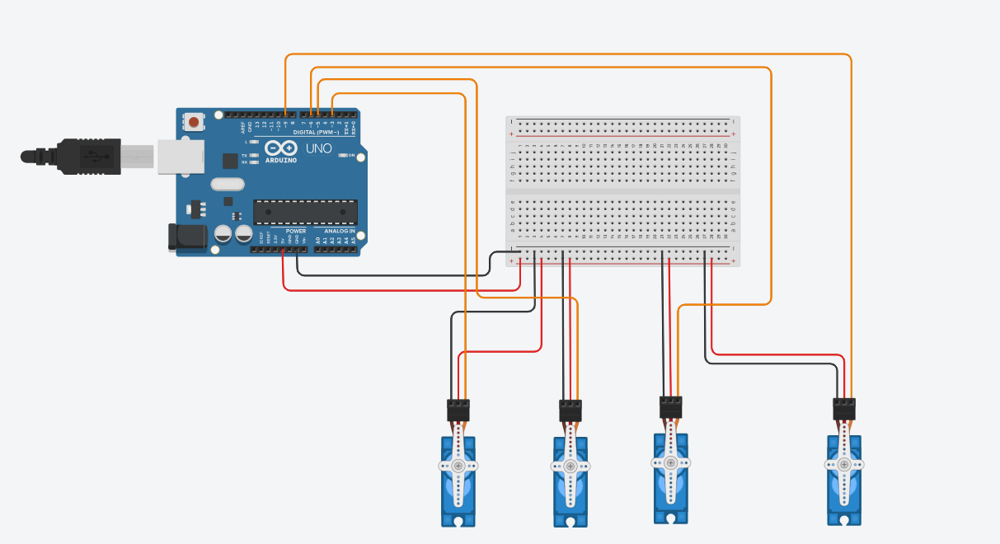

# Servo-Motors-Sweep
Control four servo motors with Arduino using the Sweep example and stop at 90 degrees.
# Servo Motors Control

This project demonstrates how to control four servo motors using an Arduino Uno and the Servo. All servo motors perform a sweep motion simultaneously for 2 seconds and then stop at a fixed position of **90°**.

---

## Project Objective

- Control four servo motors simultaneously.
- Perform the Arduino Sweep motion for 2 seconds.
- Stop all servo motors at 90°.
- Simulate the project using Tinkercad.

---

## Components

- Arduino Uno
- 4 × SG90 Servo Motors
- Breadboard
- Jumper Wires
- USB Cable (Simulation)

---

## Pin Connections

| Servo Motor | Arduino Pin |
|--------------|-------------|
| Servo 1 | D3 |
| Servo 2 | D5 |
| Servo 3 | D6 |
| Servo 4 | D9 |

All servo motors share the same **5V** and **GND** connections.

---

## How It Works

1. The Arduino initializes all four servo motors.
2. All servos perform the Sweep movement together.
3. The sweep motion continues for 2 seconds.
4. After 2 seconds, all servo motors move to 90°.
5. The motors remain fixed at 90°.

---

## Circuit Diagram



---


## Demonstration Video

You can watch the project demonstration below:

https://github.com/user-attachments/assets/72206fba-ff06-4f5f-9d9b-bbb2d5126fe4

---

## Project Files

```
Arduino-4-Servo-Motors-Control/
│── servo_sweep.ino
│── README.md
│── circuit.png
└── demo.mp4
```
---

## Software
- Tinkercad Circuits
---

## Author

**Ghaith**
